# Symbolic Music Genre Transfer with CycleGAN

- Built a CycleGAN-based model to realize music style transfer between different musical domains.
- Added extra discriminators to regularize generators to achieve clear style transfer and preserve original melody, which made our model learn more high-level features.
- Trained several genre classifiers separately, and combined them with subjective judgement to have more convincing evaluations.

**Note**: Recently I'm trying to refactorize this project in TensorFlow2.0. For those interested please go to [CycleGAN-Music-Style-Transfer-Refactorization](https://github.com/sumuzhao/CycleGAN-Music-Style-Transfer-Refactorization). 

## Paper


[Symbolic Music Genre Transfer with CycleGAN](https://arxiv.org/pdf/1809.07575.pdf)

Paper accepted at 30th International Conference on Tools with Artificial Intelligence (ICTAI), Volos, Greece, November 2018.

## Music Samples

www.youtube.com/channel/UCs-bI_NP7PrQaMV1AJ4A3HQ

## Model Architecture

Our model generally follows the same structures as CycleGAN, which consists of two GANs arranged in a cyclic fashion and trained in unison. 


G denotes generators, D denotes discriminators, A and B are two domains. Blue and red arrows denote domain transfers in the two opposite directions, and black arrows point to the loss functions. M denotes a dataset containing music from multiple domains, e.g., M is composed of A and B. x, x hat and x tilde respectively denote a real data sample from source domain, the same data sample after being transferred to target domain and the same data sample after being transferred back to the source domain. 

For the generator and the discriminator, their architectures are following:

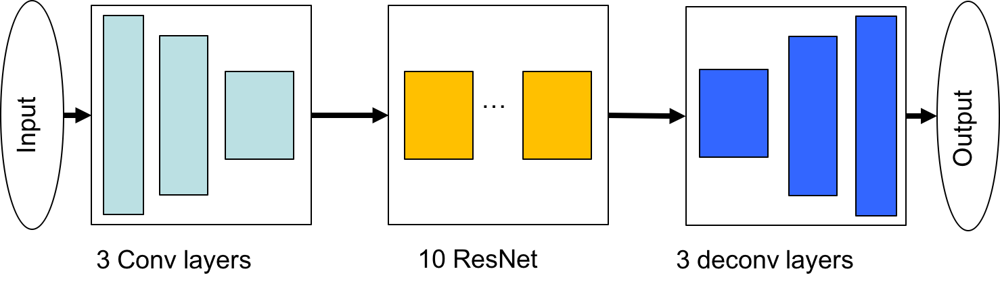
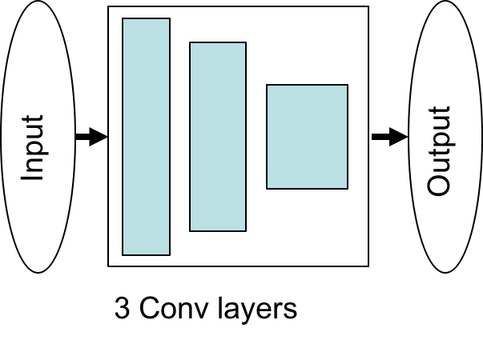

## Genre Classfier

Evaluation is an important part for experiments. But it’s really difficult to evaluate the performance of our model. So we combine a trained genre classifier and human subjective judgement to make a relatively convincing evaluation. 

The genre classifier has the architecture like this. 

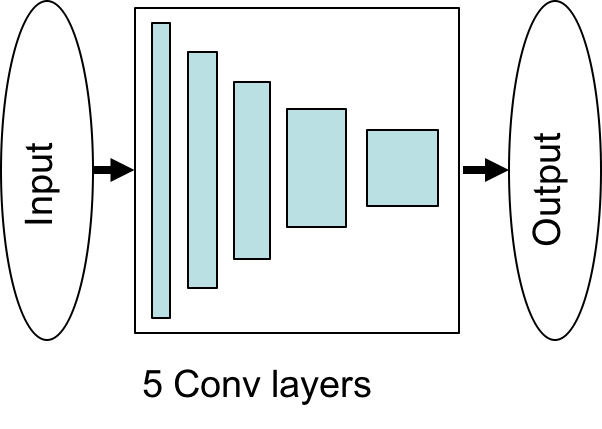

We trained our genre classifier on real data. 


We can see it can achieve very high accuracy when classifying Jazz and Classic, or Classic and Pop. But the accuracy is relatively lower, which indicates that Jazz and Pop are similar and a bit hard to distinguish even for human, at least when only considering note pitches. 

But our genre classifier aims to evaluate whether a domain transfer is successful. That is, the classifier needs to classify generated data instead of real data. We should make sure our genre classifier robust. So we add Gaussian noise with different sigma values to the inputs during testing. From table, we can conclude that our generator has generalization. 

For transfer A to B, genre classifier reports the PA (probability that the sample is classified as A) if source genre is A, and PB (probability that the sample is classified as B) if source genre is B. 

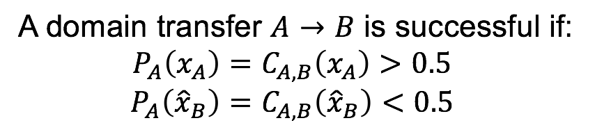

To evaluate domain transfer, we define the strength in two opposite directions A to B to A and B to A to B. 

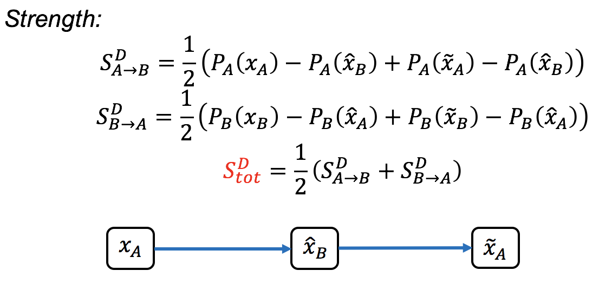

## Datasets

All the data we used to generate the audio samples on Youtube and for the evaluation in the paper can be downloaded here https://goo.gl/ZK8wLW

You can use the data set in https://drive.google.com/file/d/1zyN4IEM8LbDHIMSwoiwB6wRSgFyz7MEH/view?usp=sharing, which can be used directly. They are the same as the dataset above. 

In this project, we use music of three different styles which are Classic, Jazz and Pop. 
Originally, we collected a lot of songs of different genres from various sources. And after preprocessing, we got our final training datasets like this. Note that, To avoid introducing a bias due to the imbalance of genres, we reduce the amount of samples in the larger dataset to match that of the smaller one. 

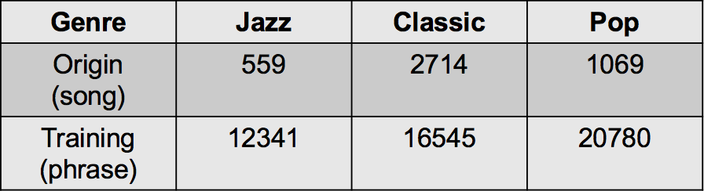

Here are some concrete preprocessing steps.

First, we convert the MIDI files to piano-rolls with two python packages pretty_midi and pypianoroll. We need to sample the MIDI files to discrete time and allow a matrix respresentation t * p. t denotes time steps and p denotes pitches. The sampling rate is 16 which means the smallest note is 16th note. We discard notes above C8 and below C0, getting 84 pitches. Considering the temporal structure, we use phrases consisting of 4 consecutive bars as training samples. So the matrix has shape 64 by 84. This why CNN is feasible for our task. 

Second, we want to retain as much of the content of the original songs as possible. Thus we merge all the tracks into one single piano track. We omit drum tracks because it will make sounds cluttered severely. And we don’t use symphonies which contains too many instruments. 

Third, we omit velocity information. We fixed every note on velocity 100, resulting in a binary-valued matrix. 1 for note on and 0 for note off. 

Last, we remove songs whose first beat does not start at time step 0 and time signature is not 4/4. We also filter songs which has time signature changes throughout the songs. 

So, the single phrase in numpy array has the format [time step, pitch range, output channel], which is [64, 84, 1].
The numpy array file in the google drive, e.g. classic_train_piano.npy, jazz_test_piano.npy, has the format [number of phrases, time step, pitch range, output channel]. When you want to train the CycleGAN model, please divide these numpy arrays into single phrase in the format [1, time step, pitch range, output channel] which is [1, 64, 84, 1]. And name them after "genre_piano_mode_number" in the ascending order. For example, the names are like "classic_piano_train_123.npy", "pop_piano_test_76.npy", etc. Later, we will upload these final datasets then you can train on them directly. 

For those who want to use their own datasets, or want to try all the preprocessing steps, please take a look at Testfile.py and convert_clean.py files. There are 6 steps in the Testfile.py which are remarked clearly. You can just comment/uncomment and run these code blocks in order. The second step is to run convert_clean.py. Please make sure all the directory paths have correct settings though it might take some time! It's very important! In addition, please ensure there are the same number of phrases (always downsampling) for each genre in a genre pair for the sake of avoiding imbalance. E.g., for classic vs. jazz, you might get 1000 phrases for classic and 500 phrases for jazz, then you should downsample the phrases for classic to 500. 


## Versions

Some important packages.
- Python 3.5.4
- Tensorflow 1.4.0
- numpy 1.14.2
- pretty_midi 0.2.8
- pypianoroll 0.1.3

And pay attention to the line below in main.py, model.py and style_classifier.py.
"os.environ["CUDA_VISIBLE_DEVICES"] = os.environ['SGE_GPU']". 
You might need to change it as the default settings when you use the GPU in your local PC or laptop. 

## Training and testing

Basically, we want our model to learn more high-level features and avoid overfitting on spurious patterns. So we add Gaussian noise to both real and fake inputs of discriminators.

We trained three different models. Base model without extra discriminators, partial model with extra discriminators where mixed dataset is data from A and B, full model with extra discriminators where mixed dataset is data from three domains.For each model on each domain pair, we tried 6 different sigma values, resulting in 54 models. We picked the best models among them. 

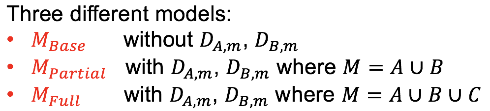

Here we show an example of base model on Jazz vs. Classic. 
The upper table shows the loss after 20 epochs. The lower table shows the genre transfer performance measured by our genre classifier. Obviously, the best model is when sigma value is 1. 

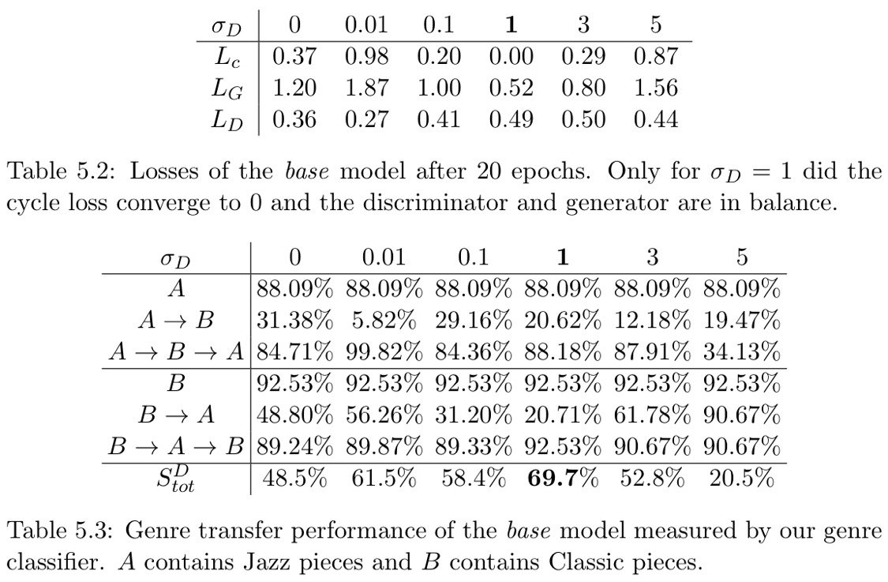

So after training 54 models, we picked all the best models, then compare Base model, Partial model and full model for each domain pair. Here we show examples for Jazz vs. Classic. We can see that three models have generally similar strength. But after checking piano-roll pictures and listening to generated samples, we can say that full model produces best samples, i.e., clear genre transfer and preserving the original melody. 

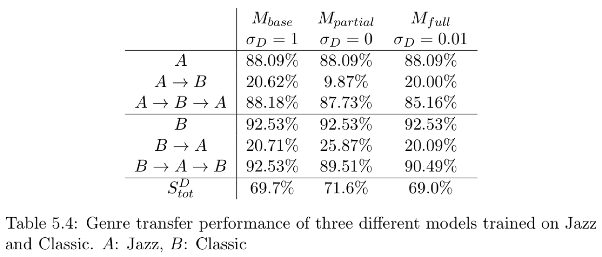

- Train a CycleGAN model:
```bash
python main.py --dataset_A_dir='JC_J' --dataset_B_dir='JC_C' --type='cyclegan' --model='base' --sigma_d=0 --phase='train'
```
There are three options for model, 'base', 'partial', 'full'. And different values can be set for sigma. 

- Test a CycleGAN model:
```bash
python main.py --dataset_A_dir='JC_J' --dataset_B_dir='JC_C' --type='cyclegan' --model='base' --sigma_d=0 --phase='test' --which_direction='AtoB'
```
You can choose 'AtoB' and 'BtoA' in which_direction. And the testing phase generates MIDI files and npy files for the origin, transfer and cycle pieces for each single phrase. 

- Train a genre classifier:
```bash
python main.py --dataset_A_dir='JC_J' --dataset_B_dir='JC_C' --type='classifier' --sigma_c=0 --phase='train'
```

- Test the trained CycleGAN model using the trained genre classifier:
```bash
python main.py --dataset_A_dir='JC_J' --dataset_B_dir='JC_C' --type='classifier' --model='base' --sigma_c=0 --sigma_d=0 --phase='test' --which_direction='AtoB'
```
This will generate new sample MIDI files attached with probability and a ranking text file for each direction. 
In the ranking file, columns are 'Id  Content_diff  P_O - P_T  Prob_Origin  Prob_Transfer  Prob_Cycle'. Each row denotes a sample phrase. We sorted the samples based on the difference of origin and transfer probabilities ('P_O - P_T') in a descending order. The higher 'P_O - P_T' is, the more successful genre transfer is. 

## Update Results

The results of this implementation:
Each row represents 4 phrases, i.e. 16 bars. The first row is the origin sample MIDI of source domain, followed by transferred samples in target domain by base model, partial model and full model. 

- Classic -> Jazz <br>
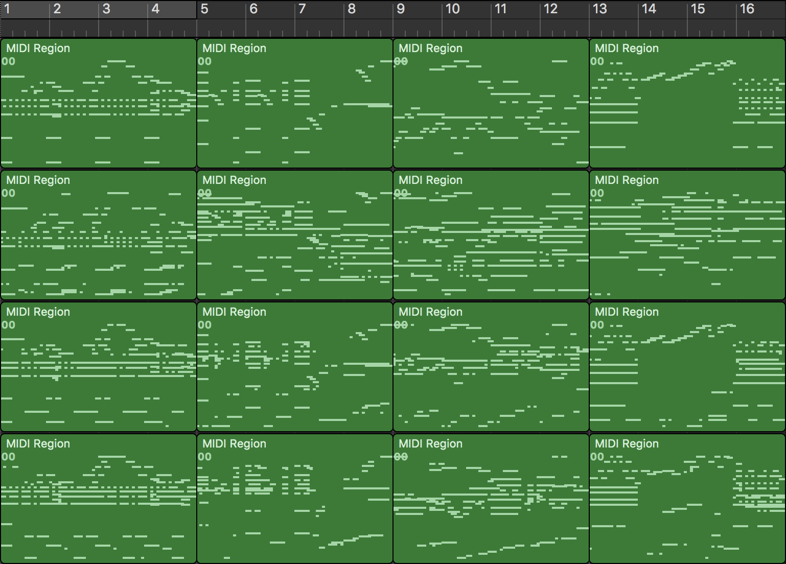 

- Jazz -> Classic <br>
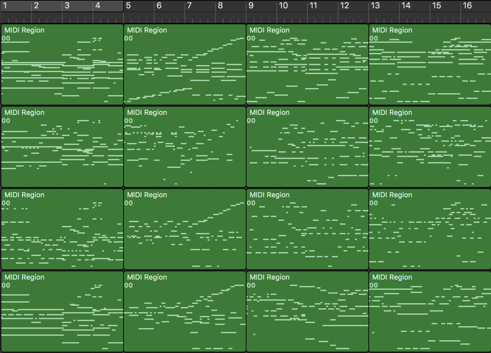 
